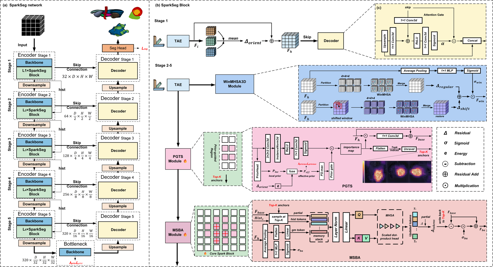
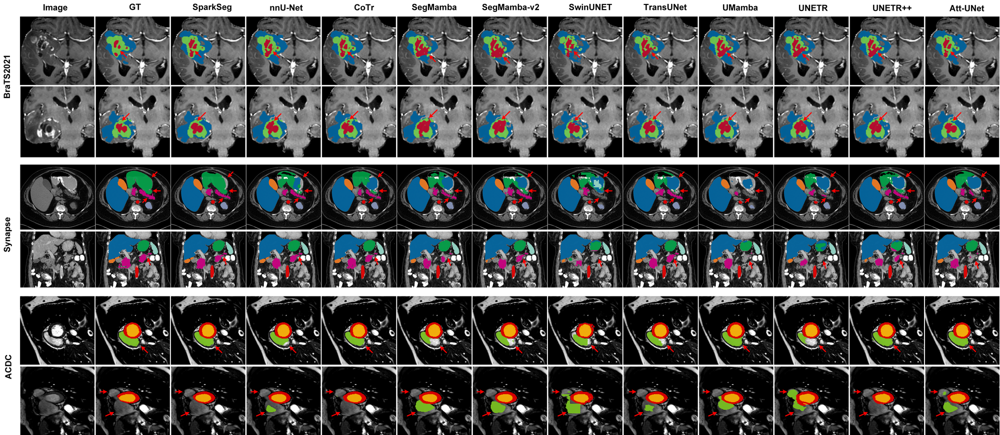
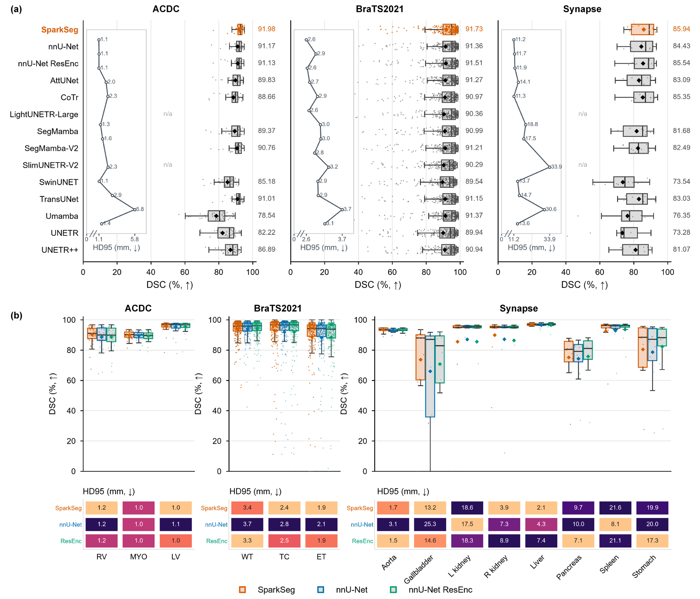
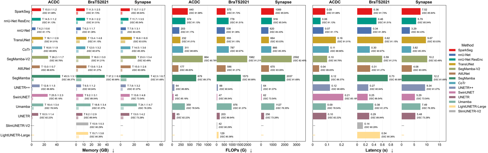
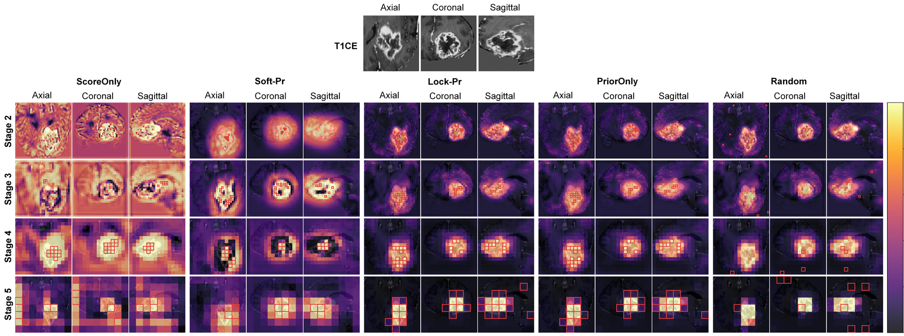
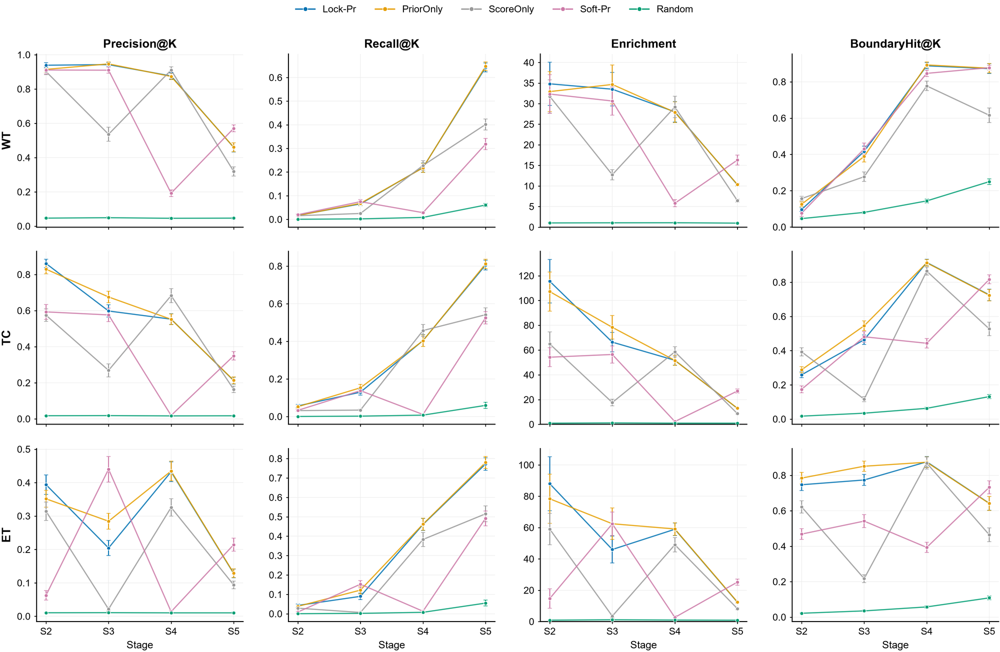

# SparkSeg

**面向三维 CT / MRI 的稀疏先验引导锚点注意力分割网络。**

[English](README.md) | 中文

<p align="center">
  
</p>

<p align="center"><sub><strong>图 1｜SparkSeg 框架总览。</strong>(a) 编码器–解码器覆盖 Stage 1–5 与瓶颈层，标注各级通道数与空间尺寸；Stage 1 只挂三轴增强（TAE），Stage 2–5 各挂一个 SparkSeg Block；<em>hist</em> 为传给下一级 Block 的历史记忆；skip 连接送入 U-Net 解码器，主干可选 plain U-Net 或 residual-encoder U-Net。(b) SparkSeg Block 及其子模块：TAE、分窗多头自注意力 WinMHSA3D（regular / shifted 两遍给出 Δ<sub>regular</sub>、Δ<sub>shift</sub> 与门 σ<sub>win</sub>）、先验门控选点 PGTS（局部先验 P<sub>loc</sub>、有效先验 P<sub>eff</sub>、逐级硬 Top-K 预算 K<sub>s</sub>）、多源稀疏块注意力 MSBA（历史源 Hist<sub>s</sub>、写回门 σ<sub>ba</sub>、token 更新 Δ<sub>tokens</sub>）。(c) 带注意力门（AG）的解码器块。算子：Δ 残差 · σ sigmoid · e 能量 · ⊖ 相减 · ⊕ 残差相加 · ⊙ 相乘。</sub></p>

SparkSeg 保持**稠密卷积网格不变**，只在**任务相关锚点**上花费**固定 token 预算**：先验门控排序器选出
**硬 Top-K** 锚点，多源稀疏块注意力**仅在这些锚点上**写回上下文，三轴增强与窗注意力负责局部细节。
同一个 Block 可跑在 plain U-Net 与 residual-encoder U-Net 两种主干上，读/写设计与主干容量解耦。

## 主要结果

| 数据集 | 稿件报告主干 | 初始化臂 | Mean DSC (%) ↑ | Mean HD95 (mm) ↓ | 训练峰值显存 | 参数量 | FLOPs | 单例延迟 (s) |
|---|---|---|---|---|---|---|---|---|
| ACDC | residual encoder | `no_stock_he` | **91.98** | **1.08** | 15.0 GB | 111.1 M | 440.4 G | 0.087 |
| Synapse/BTCV | residual encoder | `stock_he` | **85.94** | **11.21** | 13.7 GB | 111.1 M | 1,089.4 G | 7.523 |
| BraTS2021 | plain U-Net | `no_stock_he` | **91.73** | **2.57** | 11.3 GB | 34.8 M | 575.1 G | 0.356 |

三条流水线都在**单张 24 GB 显卡、11.3–15.0 GB** 区间内完成训练；在 BraTS2021 上，SparkSeg 的
FLOPs 比 SegMamba **少 2.7 倍**、显存少 3.3 倍，同时 mean DSC 更高。

## 本包包含什么

这里是**与稿件一致的网络发布包**：干净配置、逐数据集预设、模型代码、冒烟测试与配图。

| 包含 | 不包含（有意为之） |
|---|---|
| `SparkSeg` 主机、`SparkSegBlock`、`TAE`、`PriorHead`、`PGTS`、`MSBA`、`WinMHSA3D`、`AttentionGate` | nnU-Net **训练器**（在你自己的 trainer 里调用 `build_sparkseg`） |
| 干净配置 `CLEAN_CONFIG` + 逐数据集预设 `DATASET_PRESETS` | 预处理 / 实验计划脚本 |
| `verify_clean_config()` + `tests/test_sparkseg.py` | 评测脚本 |

## 命名对照：稿件 ↔ 代码

| 稿件名称 | 代码对象 | 说明 |
|---|---|---|
| SparkSeg | `SparkSeg` | 编码器–解码器主机（图 1a） |
| SparkSeg Block | `SparkSegBlock` | 每个引导级一个预算受限读/写算子（图 1b） |
| TAE — tri-axial enhancement | `TAE` | Δ_orient 与残差能量探针 e（式 1–2） |
| PriorHead — prior synthesis | `PriorHead` | P_loc → P_eff（按能量调制，式 3） |
| PGTS — prior-gated token selection | `PGTS` | importance 排序 + 硬 Top-K（式 4–6） |
| MSBA — multi-source sparse block attention | `MSBA` | 源维 softmax + 门控残差写回 |
| WinMHSA3D — windowed MHSA | `WinMHSA3D` | Δ_regular / Δ_shift、门 σ_win |
| AG — decoder attention gate | `AttentionGate` | 每级 skip 的空间软门（图 1c） |

改名前的旧名保留为**精确别名**：`SPARKUNet`、`SPARKUnit`、`SPARKDecoder`、`AxialDW3D`、
`TokenAllocationNetwork`、`LocalSelectiveBlockAttn`、`WindowMHSA3D`、`DecoderAttentionGate`、
`build_sparkunet`。

## 快速开始

```python
from SparkSeg import build_sparkseg, describe_preset, DATASET_PRESETS

# strides 来自宿主 plans：
#   configuration_manager.network_arch_init_kwargs["strides"]
strides = [[1, 1, 1], [2, 2, 2], [2, 2, 2], [2, 2, 2], [2, 2, 2], [2, 2, 2]]

print(describe_preset("brats"))
# brats (Dataset1251) host=plainconv patch=(128, 128, 128) batch=2 epochs=1000
# K=(128, 64, 32, 32) | reported: mean_dsc=91.73, mean_hd95=2.57, ...

net = build_sparkseg(in_channels=4, out_channels=4, plan_strides=strides, preset="brats")
```

`preset` 可传数据集键（`"acdc"` / `"synapse"` / `"brats"`）、nnU-Net 数据集编号（`100` / `180` / `1251`）
或文件夹名（`"Dataset1251_BraTS2023GLI"`）。不传 `preset` 时按干净配置在 plain U-Net 主机构建；
`build_sparkseg_for("acdc", ...)` 等价于 `build_sparkseg(..., preset="acdc")`。网络命名空间下的规范导入是
`from nnunetv2.training.network.SparkSeg import build_sparkseg`。

训练模式下主机返回 `(seg, prior)`（`prior` 供辅助先验损失），并通过 `net._last_stage_p_effs` 暴露每个
引导级的 P_eff；推理模式只返回分割输出，滑窗推理无需改动。

## 干净配置（稿件默认）

| 组成 | 设定 |
|---|---|
| 初始化 | `stock_he` —— He(1e-2) 建网后初始化 + 残差加前末 BN 归零（产品默认）。两个训练变体为 `nnUNetTrainer*_StockHe` / `*_NoStockHe`；预设采用"产出该报告数值的那一臂"（见下表） |
| 阶段挂载 | Stage 1（E0）只挂 TAE · Stage 2–5（E1–E4）各一个 SparkSeg Block · Stage 6（E5）CNN 瓶颈 + PriorHead |
| 锚点预算 | 硬 Top-K 128/64/32/32（式 4–6：α = 8、K_min = 32、K_max = 512、S = 6） |
| 局部窗注意力 | 4×4×4 窗、4 heads、regular + 半窗 shift（shift = 2） |
| 门控 | σ_ba 与 σ_win 起始关闭（标量 bias −2.5）；解码器 AG 起始近恒等（bias +4） |
| 辅助损失 | λ_prior = 0.05、λ_prioraux = 0.02（式 8） |
| 优化器 / 调度 | SGD，lr 1e-2，Nesterov 0.99，weight decay 3e-5，多项式衰减；每轮 250 次训练 / 50 次验证迭代 |

`SparkSeg.py` 中的 `CLEAN_CONFIG` 是唯一事实来源；`verify_clean_config()` 会与冻结它的训练栈逐键核对
（一致时返回 `{"checked": True, "mismatch": {}}`）。

## 逐数据集配置（稿件 Table 9）

| 数据集 | 报告配置 | 初始化臂 | Batch size | Patch size | Epochs | Mean DSC（plain / residual 主干） |
|---|---|---|---|---|---|---|
| BraTS2021 | Plain U-Net 主干 | `no_stock_he` | 2 | 128×128×128 | 1,000 | 91.73 / 91.50 |
| ACDC | Residual-encoder U-Net 主干 | `no_stock_he` | 7 | 224×256×10 | 200 | 91.18 / 91.98 |
| Synapse | Residual-encoder U-Net 主干 | `stock_he` | 2 | 56×192×224 | 1,000 | 85.73 / 85.94 |

**初始化臂** 列是溯源而非偏好：它记录"产出该报告端点"的初始化变体（`no_stock_he` = 论文期那批没有
He 后初始化的 run；`stock_he` = He(1e-2) + 末 BN 归零）。三个基准的另一臂也都跑过，两臂差异 ≤0.72 DSC
——见下方说明。`build_sparkseg(..., preset=...)` 会采用此列对应的臂；需要时显式传 `stock_he=True`/`False` 覆盖。

> 说明：报告数值来自进入稿件的那批 run，它们早于当前 K 金字塔（当时用的是更紧的 64/32/32/32 预算与旧代码
> 快照），因此请把该列理解为端点的溯源，而不是受控单变量消融。

同样的数字就在代码里：

```python
from SparkSeg import DATASET_PRESETS
DATASET_PRESETS["acdc"].host          # 'resenc'
DATASET_PRESETS["acdc"].init          # 'no_stock_he'（91.98 背后的臂）
DATASET_PRESETS["acdc"].reported      # {'mean_dsc': 91.98, 'mean_hd95': 1.08, ...}
```

## 结果

表 2–4 复现稿件基准表（DSC ↑ %、HD95 ↓ mm；最后四列为三个数据集统一口径下的近似估计；前两行是保持
基线 nnU-Net 计划的对照主干）。

### 表 2｜BraTS2021 held-out 测试集（WT/TC/ET）

| 模型 | WT | TC | ET | Avg. | WT | TC | ET | Avg. | Mem T/I (GB) | Params (M) | FLOPs (G) | Latency (s) |
|---|---|---|---|---|---|---|---|---|---|---|---|---|
| nnU-Net | 93.96 | 91.91 | 88.22 | 91.36 | 3.68 | 2.83 | 2.06 | 2.86 | ~6.2 / 1.7 | ~31.2 | ~538.1 | ~0.340 |
| nnU-Net ResEnc | 94.05 | 91.92 | 88.57 | 91.51 | 3.33 | 2.54 | 1.93 | 2.6 | ~11.6 / 2.2 | ~102.4 | ~778.3 | ~0.460 |
| AttUNet | 94.02 | 91.59 | 88.2 | 91.27 | 3.29 | 2.54 | 2.17 | 2.67 | ~13.6 / 2.4 | ~23.6 | ~586 | ~0.311 |
| CoTr | 93.78 | 91.13 | 87.99 | 90.97 | 3.59 | 2.97 | 2.17 | 2.91 | ~12.0 / 3.2 | ~41.9 | ~787.4 | ~0.301 |
| LightUNETR-Large | 93.46 | 90.55 | 87.08 | 90.36 | 3.22 | 2.69 | 2.05 | 2.65 | ~15.7 / 3.8 | ~3.9 | ~129.4 | ~0.544 |
| SegMamba | 94.04 | 91.35 | 87.57 | 90.99 | 3.73 | 3.08 | 2.2 | 3 | ~37.2 / 6.9 | ~67.4 | ~1573 | ~0.728 |
| SegMamba-V2 | 93.89 | 91.44 | 88.3 | 91.21 | 3.8 | 2.73 | 2.49 | 3.01 | ~18.0 / 3.0 | ~139.2 | ~1982.5 | ~0.595 |
| SlimUNETR-V2 | 92.93 | 91.74 | 86.2 | 90.29 | 3.49 | 2.54 | 2.43 | 2.82 | ~15.9 / 0.3 | ~23.6 | ~41.9 | ~0.138 |
| SwinUNET | 92.97 | 89.85 | 85.8 | 89.54 | 4.25 | 3.14 | 2.37 | 3.25 | ~9.2 / 3.1 | ~30.6 | ~46.8 | ~0.251 |
| TransUNet | 93.58 | 91.36 | 88.5 | 91.15 | 3.94 | 2.82 | 1.99 | 2.92 | ~13.4 / 4.8 | ~119.0 | ~555 | ~0.620 |
| Umamba | 93.78 | 91.74 | 88.58 | 91.37 | 3.78 | 2.78 | 2.22 | 2.93 | ~18.8 / 3.4 | ~42.2 | ~975.5 | ~0.384 |
| UNETR | 92.97 | 90.18 | 86.67 | 89.94 | 4.18 | 3.85 | 2.96 | 3.66 | ~8.2 / 2.9 | ~130.8 | ~202.8 | ~0.288 |
| UNETR++ | 93.54 | 91.69 | 87.59 | 90.94 | 3.93 | 3.06 | 2.4 | 3.13 | ~6.5 / 1.2 | ~23.5 | ~87.5 | ~0.265 |
| **SparkSeg** | 93.87 | **92.68** | 88.63 | **91.73** | 3.41 | **2.41** | **1.89** | **2.57** | ~11.3 / 2.5 | ~34.8 | ~575.1 | ~0.356 |

### 表 3｜ACDC held-out 测试集（RV/MYO/LV）

| 模型 | RV | MYO | LV | Avg. | RV | MYO | LV | Avg. | Mem T/I (GB) | Params (M) | FLOPs (G) | Latency (s) |
|---|---|---|---|---|---|---|---|---|---|---|---|---|
| nnU-Net | 88.66 | 89.51 | 95.33 | 91.17 | 1.25 | 1.02 | 1.06 | 1.11 | ~6.2 / 0.6 | ~31.2 | ~203.4 | ~0.075 |
| nnU-Net ResEnc | 88.7 | 89.27 | 95.41 | 91.13 | 1.22 | 1.02 | 1.03 | 1.09 | ~14.5 / 1.2 | ~102.4 | ~374.3 | ~0.055 |
| AttUNet | 86.6 | 88.15 | 94.72 | 89.83 | 4.04 | 1.04 | 1.04 | 2.04 | ~13.0 / 0.7 | ~23.6 | ~176.9 | ~0.045 |
| CoTr | 85.24 | 86.68 | 94.07 | 88.66 | 4.64 | 1.09 | 1.09 | 2.27 | ~16.8 / 1.9 | ~41.9 | ~310.7 | ~0.112 |
| SegMamba | 85.79 | 87.95 | 94.39 | 89.37 | 1.73 | 1.14 | 1.07 | 1.31 | ~45.5 / 3.1 | ~67.4 | ~678.8 | ~0.117 |
| SegMamba-V2 | 87.94 | 89.1 | 95.22 | 90.76 | 2.58 | 1.13 | 1.04 | 1.58 | ~26.2 / 1.7 | ~139.2 | ~863.6 | ~0.100 |
| SwinUNET | 80.61 | 82.63 | 92.31 | 85.18 | 4.38 | 1.31 | 1.19 | 2.29 | ~25.5 / 2.3 | ~30.6 | ~40.4 | ~0.212 |
| TransUNet | 88.73 | 89.07 | 95.24 | 91.01 | 1.29 | 1.03 | 1.02 | 1.12 | ~18.1 / 2.6 | ~119.0 | ~232.4 | ~0.161 |
| Umamba | 71.23 | 75.3 | 89.09 | 78.54 | 4.64 | 2.07 | 1.89 | 2.87 | ~18.4 / 3.4 | ~42.2 | ~359.3 | ~0.092 |
| UNETR | 74.98 | 80.84 | 90.84 | 82.22 | 14.31 | 1.62 | 1.55 | 5.83 | ~10.5 / 1.4 | ~130.8 | ~85.4 | ~0.095 |
| UNETR++ | 82.23 | 85.39 | 93.06 | 86.89 | 1.9 | 1.29 | 1.14 | 1.44 | ~12.8 / 1.5 | ~23.5 | ~64.1 | ~0.120 |
| **SparkSeg** | **90.24** | 89.9 | **95.8** | **91.98** | **1.19** | 1.02 | 1.02 | **1.08** | ~15.0 / 1.2 | ~111.1 | ~440.4 | ~0.087 |

### 表 4｜Synapse 12 例 held-out 测试集（八个腹部器官）

| 模型 | Aor. | Gal. | LKid. | RKid. | Liv. | Pan. | Spl. | Sto. | Avg. | Aor. | Gal. | LKid. | RKid. | Liv. | Pan. | Spl. | Sto. | Avg. | Mem T/I (GB) | Params (M) | FLOPs (G) | Latency (s) |
|---|---|---|---|---|---|---|---|---|---|---|---|---|---|---|---|---|---|---|---|---|---|---|
| nnU-Net | 92.7 | 66.09 | 87.07 | 87.17 | 96.54 | 74.3 | 92.86 | 78.7 | 84.43 | 3.12 | 25.26 | 17.5 | 7.26 | 4.29 | 10.02 | 8.14 | 20.04 | 11.72 | ~7.9 / 3.1 | ~31.2 | ~619.6 | ~3.290 |
| nnU-Net ResEnc | 93.16 | 70.77 | 85.6 | 86.45 | 96.48 | 75.83 | 93.69 | 82.31 | 85.54 | 1.48 | 14.6 | 18.34 | 8.94 | 7.41 | 7.09 | 21.13 | 17.34 | 11.91 | ~11.7 / 3.5 | ~102.4 | ~916.2 | ~5.785 |
| AttUNet | 92.91 | 68.55 | 83.68 | 84.97 | 96.36 | 69.72 | 91.95 | 76.55 | 83.09 | 4.83 | 23.22 | 7.91 | 24 | 3.19 | 10.44 | 8.13 | 32.88 | 14.11 | ~15.0 / 2.6 | ~23.6 | ~670.4 | ~4.079 |
| CoTr | 93.48 | 67.06 | 86.84 | 86.3 | 96.82 | 78.68 | 92.97 | 80.64 | 85.35 | 1.49 | 18.45 | 15.91 | 10.15 | 2.16 | 6.4 | 6.95 | 31.51 | 11.29 | ~14.5 / 3.6 | ~41.9 | ~865.6 | ~3.818 |
| SegMamba | 91.03 | 61.18 | 85.43 | 86.99 | 95.83 | 68.26 | 91.47 | 73.24 | 81.68 | 8.74 | 31.36 | 17.85 | 6.16 | 15.8 | 9.56 | 29.31 | 33.66 | 18.76 | ~42.3 / 8.7 | ~67.4 | ~2037.2 | ~12.166 |
| SegMamba-V2 | 92.5 | 59.65 | 87.71 | 85.23 | 95.92 | 70.15 | 94.83 | 73.9 | 82.49 | 8.09 | 22.52 | 15.29 | 22.53 | 18.16 | 16.04 | 6.6 | 32.42 | 17.5 | ~23.0 / 3.4 | ~139.2 | ~2591.6 | ~10.181 |
| SwinUNET | 83.3 | 54.93 | 79.2 | 74.86 | 92.85 | 49.66 | 85.29 | 68.21 | 73.54 | 34.78 | 23.13 | 53.22 | 28.03 | 17.86 | 16.43 | 62.78 | 36.69 | 33.92 | ~13.6 / 4.8 | ~30.6 | ~62.0 | ~5.292 |
| TransUNet | 93.18 | 64.04 | 85.65 | 87.03 | 96.57 | 70.69 | 91.25 | 75.81 | 83.03 | 1.87 | 25.85 | 18.73 | 8.88 | 1.76 | 11.04 | 13.3 | 30.17 | 13.7 | ~16.8 / 6.9 | ~119.0 | ~663.8 | ~9.667 |
| Umamba | 91.64 | 58.98 | 80.94 | 77.3 | 96.03 | 60.08 | 87.66 | 58.2 | 76.35 | 11.34 | 23.03 | 4.96 | 10.81 | 4.76 | 28.66 | 11.5 | 24.55 | 14.74 | ~24.1 / 4.7 | ~42.2 | ~1126.8 | ~7.493 |
| UNETR | 84.49 | 63.26 | 78.44 | 78.01 | 93.79 | 51.34 | 80.49 | 56.4 | 73.28 | 10.91 | 18.71 | 26.95 | 46.51 | 42.48 | 23.24 | 38.98 | 37.76 | 30.55 | ~13.0 / 4.2 | ~130.8 | ~256.4 | ~5.476 |
| UNETR++ | 91.78 | 58.16 | 86.61 | 85.45 | 95.84 | 64.81 | 91.19 | 74.73 | 81.07 | 2.43 | 18.04 | 17.31 | 24.51 | 3.5 | 11.42 | 8.97 | 23.78 | 13.61 | ~7.8 / 3.2 | ~23.5 | ~64.5 | ~9.335 |
| **SparkSeg** | 93.25 | **73.66** | 85.54 | **89.93** | 96.97 | 75.2 | 92.49 | 80.45 | **85.94** | 1.67 | **13.23** | 18.6 | **3.87** | 2.12 | 9.66 | 21.57 | 19.86 | **11.21** | ~13.7 / 2.7 | ~111.1 | ~1089.4 | ~7.523 |

逐例配对 Wilcoxon 检验（双侧、Bonferroni 校正）确认 ACDC 增益（p < 1e-6；34/40 胜），
Synapse 12 例 split 上 10/12 胜（p = 0.034，校正后 0.068）；BraTS2021 上 SparkSeg 与 nnU-Net
逐例相当（p = 0.90；120/251），但均值提高 +0.36 DSC。相对主干匹配的对照，同一个 Block 分别带来
**+0.85（ACDC）**、**+0.36（BraTS2021）**、**+0.40（Synapse）** mean DSC。

## 配图

### 图 2｜BraTS2021 / Synapse / ACDC 定性对比

<p align="center"></p>

<p align="center"><sub>每个数据集两行；首列为输入图像，其余列叠加 GT 与各方法预测。SparkSeg 使用各数据集报告的配置。</sub></p>

### 图 3｜三个 held-out 基准上的逐例 DSC 分布

<p align="center"></p>

<p align="center"><sub>(a) 每行一个对比方法（SparkSeg 在最上），箱体为 median/IQR，散点为各 held-out 病例（ACDC 40、BraTS2021 251、Synapse 12），插图为 mean HD95；(b) SparkSeg 与两个主干匹配对照的分解剖类别逐例 DSC。</sub></p>

### 图 4｜各方法资源画像

<p align="center"></p>

<p align="center"><sub>逐方法、逐数据集的训练峰值（实心）与单 patch 推理（浅色）显存、FLOPs 与整例延迟，并在对应柱上标注该方法的 DSC。资源轴一律越低越好；SparkSeg 为斜线填充。</sub></p>

### 图 5｜单个 BraTS 病例上的先验引导 Top-K 锚点

<p align="center"></p>

<p align="center"><sub>行为 Stage 2–5；列组为 ScoreOnly、Soft-Pr、Lock-Pr（默认）、PriorOnly 与 Random，每组含轴位、冠状位与矢状位。热图为驱动硬 Top-K 的排序分数。</sub></p>

### 图 6｜BraTS2021 held-out 选点质量（n = 251）

<p align="center"></p>

<p align="center"><sub>行：WT/TC/ET；列：Precision@K、Recall@K、Enrichment 与 BoundaryHit@K（Stage 2–5）。标记为逐例均值，须为近似 95% CI。Random 为均匀-K 参考（Enrichment ≈ 1）。</sub></p>

配图为稿件图 1–6，仓库内统一缩放到 2000 px；全分辨率原图随稿件文件一并提供。

## 目录结构

```
SparkSeg/
├── SparkSeg.py                 # 网络本体：主机 + 构建函数（只做装配）
├── blocks.py                   # TAE、PGTS、MSBA、WinMHSA3D、PriorHead、AG、SparkSegBlock、解码器
├── utils.py                    # 宿主几何、encoder 构建、K 预算、打分工具、初始化
├── config.py                   # CLEAN_CONFIG + DATASET_PRESETS + 辅助函数
├── __init__.py                 # 公共 API（__version__ = 1.0.0）
├── LICENSE.txt                 # Apache-2.0
├── META.json                   # 溯源/审计元数据
├── docs/ARCHITECTURE.md        # 架构参考（模块、公式、API、消融）
├── assets/paper/               # 稿件配图（图 1–6）
└── tests/test_sparkseg.py      # K 日程 + 干净配置漂移 + 预设 + 前向
```

## 测试

```bash
python -m pytest nnunetv2/training/network/source_code/SparkSeg/tests/test_sparkseg.py -q
```

覆盖：Top-K 日程等于稿件的 128/64/32/32；`CLEAN_CONFIG` 与训练栈一致（`verify_clean_config()`）；
预设解析到报告主干；两种主干均可构建并跑通训练/推理前向；旧名为精确别名。

## 数据

下列网盘提供**已转换为 nnU-Net 格式**的数据包；官方源站用于引用与授权。使用前请遵守各数据集原始条款。

### ACDC

| 类型 | 链接 |
|---|---|
| nnU-Net 格式（百度网盘） | [ACDC](https://pan.baidu.com/s/1UpbyOIFCrYgThEsCaDyAWg?pwd=fr7t) · 提取码 `fr7t` |
| nnU-Net 格式（阿里云盘） | [ACDC](https://www.alipan.com/s/EJPiXceGWZV) |
| 官方源 | [Human Heart Project / ACDC](https://humanheart-project.creatis.insa-lyon.fr/database/#collection/637218c173e9f0047faa00fb) |
| TransUNet 划分预处理参考 | [Google Drive](https://drive.google.com/drive/folders/1KQcrci7aKsYZi1hQoZ3T3QUtcy7b--n4) |

### Synapse / BTCV

| 类型 | 链接 |
|---|---|
| nnU-Net 格式（百度网盘） | [Synapse](https://pan.baidu.com/s/1IvX_5Q1h6QeSDa__gjEX_A?pwd=drsm) · 提取码 `drsm` |
| 官方源（BTCV / Synapse） | [Synapse: syn3193805](https://www.synapse.org/Synapse:syn3193805/wiki/89480) |
| TransUNet 划分预处理参考 | [Google Drive](https://drive.google.com/drive/folders/1ACJEoTp-uqfFJ73qS3eUObQh52nGuzCd) |

### BraTS 2021 Adult Glioma

论文与实验口径为 **BraTS 2021** 公开带标注训练队列（1251 例）。BraTS 2022/2023 Adult Glioma 为同一队列的
再分发，**不等于** BraTS 2025 Lighthouse。

| 类型 | 链接 |
|---|---|
| nnU-Net 格式（阿里云盘） | [Dataset1251_BraTS2021GLI](https://www.alipan.com/s/M7cS2KvaAuK) |
| 官方源（BraTS 2021） | [Synapse: syn25829067](https://www.synapse.org/Synapse:syn25829067) |
| 同队列再分发参考（2023 challenge 页） | [Synapse: syn51156910](https://www.synapse.org/Synapse:syn51156910/wiki/622351) |
| Kaggle 镜像（同队列） | [part-1](https://www.kaggle.com/datasets/aiocta/brats2023-part-1) · [part-2](https://www.kaggle.com/datasets/aiocta/brats2023-part-2zip) |

## 引用

若本工作与您的研究相关，请引用 SparkSeg 论文（接受后在此补充 BibTeX / DOI）。

## License

[Apache License 2.0](LICENSE.txt)。训练与推理基于 [nnU-Net](https://github.com/MIC-DKFZ/nnUNet)；
公开数据集须遵守各自使用条款。
